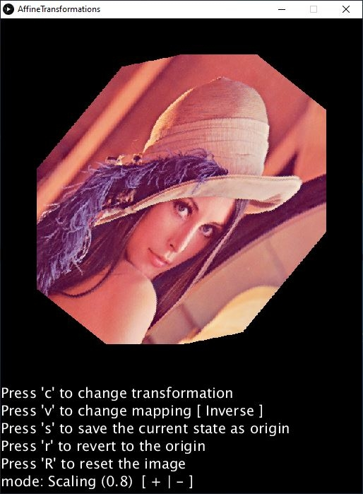

# :large_blue_diamond: Affine Transformation of Image Processing

## About the project

 A very basic showcase of image processing's affine transformation (scale, rotation, shear, translate) created using Processing.

 The aim of this project is to show the various affine transformation available and to point out the difference between forward mapping and inverse mapping.

---

## Features

These are the implementation goal of this project:

- [x] Forward Mapping
- [x] Inverse Mapping
- [x] Rotation
- [x] Scale
- [x] Translate
- [x] Shear (Vertical and Horizontal)
- [x] Simple Interaction

---

## How it works

It just applies the basic affine transformation on a sample image (Lenna). Using the pre-configured keys you can manipulate the transformation.

- Pressing __C__ (_case-insensitive_) will change the current transformation;
- Pressing __S__ (_case-insensitive_) will save the current image as __origin image__ so the next transformations will be applied starting from the saved state;
- Pressing __R__ (_case-sensitive_) will reset the __origin image__ to the un-transformed/initial one;
- Pressing __r__ (_case-sensitive_) will revert the current image state to the __origin state__;
- Pressing __V__ (_case-insensitive_) will change the mapping function (__Forward and Inverse__);
- Pressing __+, -, /, *__ will alter the transformation:
  - Rotation [_+, -_]: Increase/Decrease the degree;
  - Scale [_+, -_]: Increase/Decrease the zoom factor;
  - Translation [_+, -_]: Increase/Decrease the X offset;
  - Translation [_*, /_]: Increase/Decrease the Y offset;
  - Shear Vertical [_+, -_]: Increase/Decrease the degree;
  - Shear Horizontal [_+, -_]: Increase/Decrease the degree;

---

## How to use a custom image

This showcase doesn't allow to load a custom image, but you can easly import your own image by replacing the _"lenna.png"_ image located inside the __data__ folder.

__*__ It is important that your image is in a PNG format and that it is called "lenna.png"

---

## Requirements

If you are using the no java-jre bundle version you require:

- Java8+ installed on your system

Otherwise you don't need any pre-requisite.

---

## How to build

Use Processing editor to export a new application with the updated source.

---

## License

This project is under [MIT License](LICENSE)
